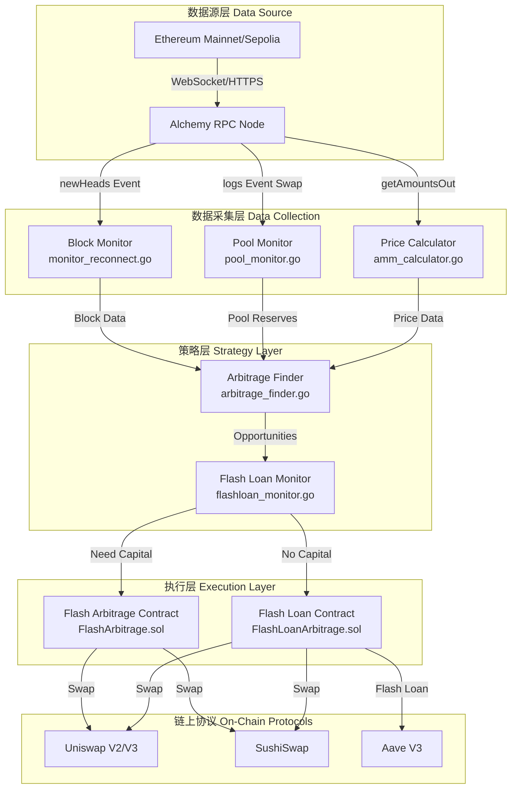
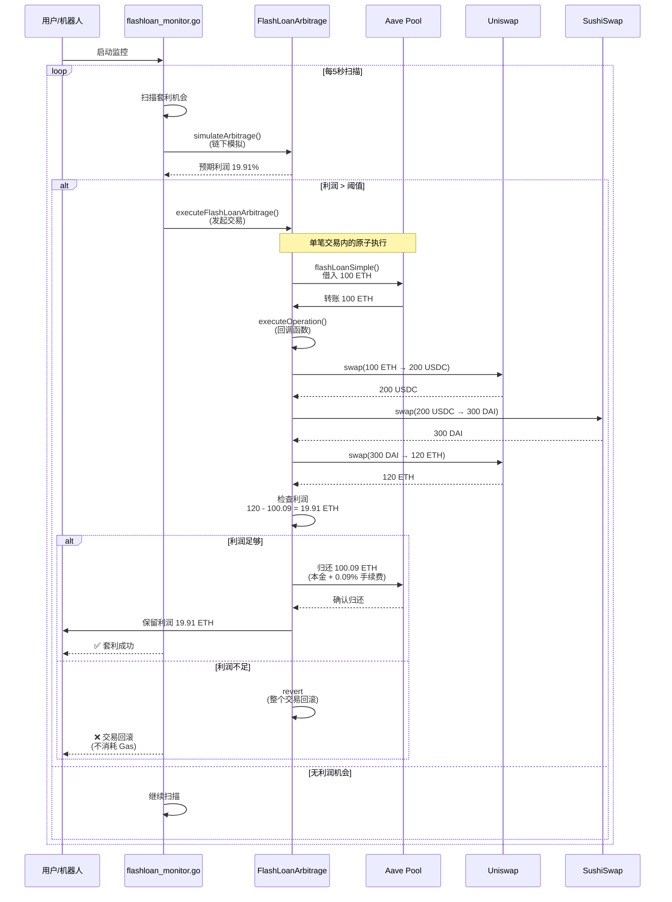
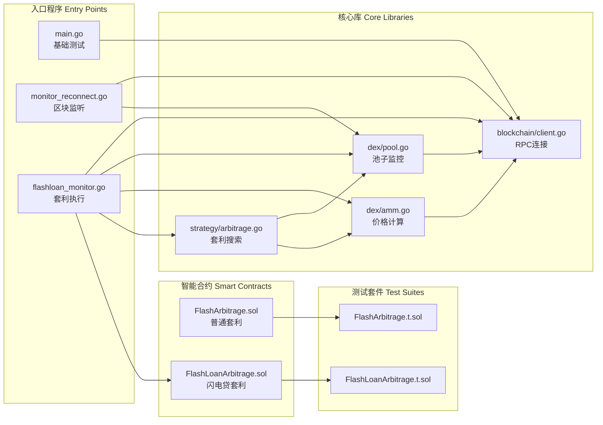
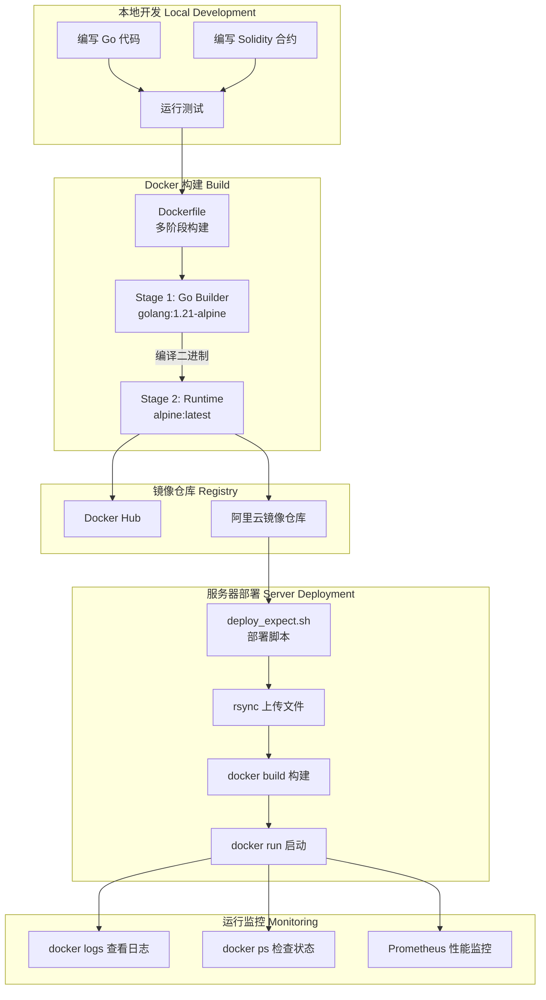
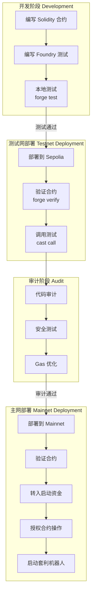
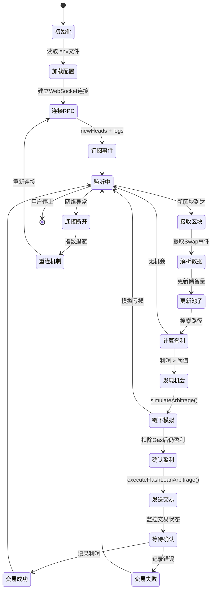
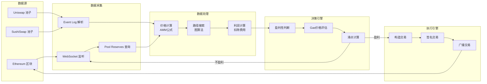
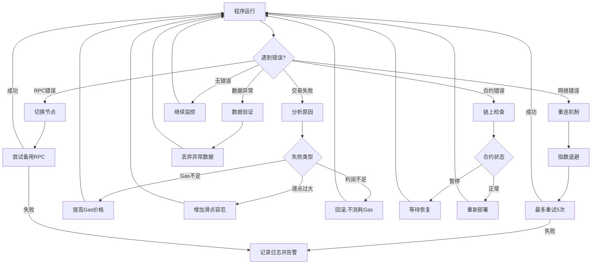

# Web3 量化交易机器人 - 系统流程图

## 1. 整体系统架构

## 2. 闪电贷套利详细流程

## 3. 代码文件依赖关系

## 4. Docker 部署流程

## 5. 合约部署与测试流程

## 6. Go 程序执行流程

## 7. 数据流转详图

## 8. 错误处理流程

---

## 📋 文件清单说明

### **Go 源文件作用**

| 文件 | 行数 | 核心功能 | 依赖 |
|-----|------|---------|------|
| `main.go` | 80 | 基础测试：连接RPC，查余额 | go-ethereum, godotenv |
| `monitor.go` | 100 | 简单区块监听器 | go-ethereum |
| `monitor_reconnect.go` | 150 | 生产级监听器（重连+心跳） | go-ethereum |
| `pool_monitor.go` | 180 | Uniswap Swap事件监听 | go-ethereum, abi |
| `amm_calculator.go` | 200 | AMM价格计算（Uniswap公式） | math/big |
| `arbitrage_finder.go` | 250 | 三角套利路径搜索 | math/big |
| `flashloan_monitor.go` | 300 | 闪电贷套利监控器 | go-ethereum, abi, bind |

### **Solidity 合约作用**

| 文件 | 行数 | 核心功能 | 外部依赖 |
|-----|------|---------|---------|
| `FlashArbitrage.sol` | 180 | 普通套利（需自有资金） | Uniswap Router |
| `FlashLoanArbitrage.sol` | 308 | 闪电贷套利（无需资金） | Aave V3 Pool |
| `FlashArbitrage.t.sol` | 250 | 套利合约测试 | Foundry Test |
| `FlashLoanArbitrage.t.sol` | 400 | 闪电贷合约测试 | Foundry Test |

### **部署脚本作用**

| 文件 | 行数 | 用途 | 依赖工具 |
|-----|------|------|---------|
| `deploy.sh` | 120 | SSH自动部署（sshpass） | sshpass, rsync |
| `deploy_expect.sh` | 85 | SSH自动部署（expect） | expect, rsync |
| `Dockerfile` | 40 | Docker镜像构建 | Docker |
| `docker-compose.yml` | 20 | 服务编排 | Docker Compose |

---

**版本**: v1.0  
**生成时间**: 2026-02-03  
**格式**: Mermaid Diagram
