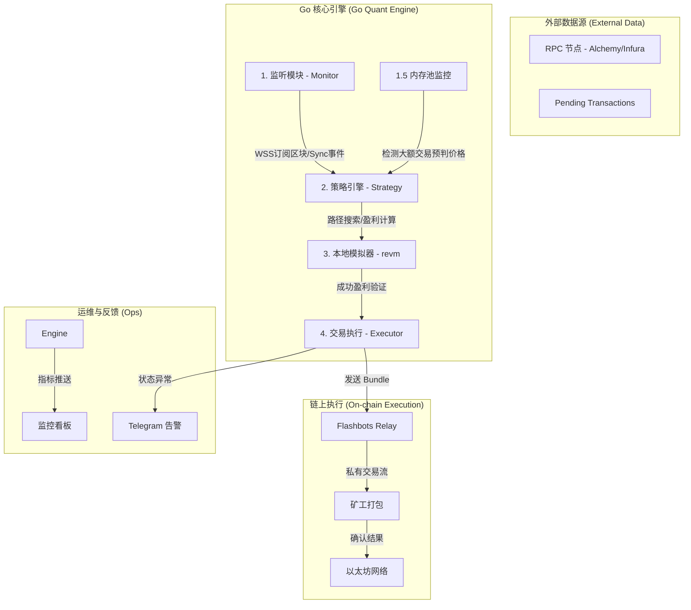

# Go Web3 量化交易机器人 (Go-Web3-Quant) 技术方案

> **核心目标**：构建一个极低延迟、高并发、且具备原子化交易保障的自动化套利系统。

---

## 一、 整体架构图 (System Architecture)

---

## 二、 前期准备清单

### 1. 账号与服务
*   **RPC 节点**：注册 [Alchemy](https://dashboard.alchemy.com/) 或 [Infura](https://infura.io/)，获取 **WSS** 链接。
*   **Flashbots**：了解 [MEV-Boost](https://flashbots.net/) 原理，后续需要配置 Relay 地址。
*   **钱包**：准备一个**开发专用钱包**，存入少量测试币（Sepolia ETH）。

### 2. 环境搭建
*   **Go 语言**：安装 Go 1.21+，配置 `GOPATH`。
*   **Foundry**：用于 Solidity 合约的编写、测试与部署。
    *   安装：`curl -L https://foundry.paradigm.xyz | bash`
*   **Docker**：用于后期部署生产环境。

---

## 三、 技术栈选型

*   **链下逻辑 (Bot)**：**Golang**
    *   **理由**：高并发处理、原生支持 WebSocket、Geth 官方库支持。
*   **链上逻辑 (Contract)**：**Solidity + Yul**
    *   **理由**：极致的 Gas 优化，确保在套利竞争中具有成本优势。
*   **通信协议**：**WebSocket (WSS)** + **JSON-RPC**。

---

## 四、 项目开发流程 (Roadmap)

### 阶段 1：数据基座 (Data Foundation)
*   **任务**：建立稳定的 WSS 连接，实现自动重连机制。
*   **学习点**：Go 异步处理、订阅/发布模式、区块头解析。

### 阶段 2：池子监控与价格计算 (Pool & Price)
*   **任务**：监听特定 DEX 池子（如 Uniswap V2/V3）的储备量变化。
*   **学习点**：AMM 数学模型、大数运算 (math/big)、合约查询。

### 阶段 3：策略引擎 (Strategy Engine)
*   **任务**：实现环路套利路径搜索算法（Bellman-Ford）。
*   **学习点**：图论算法优化、盈利预估、滑点计算。

### 阶段 4：原子执行与模拟 (Execution & Simulation)
*   **任务**：编写执行合约，集成本地模拟器验证结果。
*   **学习点**：Flashbots 捆绑包发送、EVM 本地模拟、Gas 竞价策略。

### 阶段 5：部署与运维 (Deployment & Ops)
*   **任务**：Docker 打包，部署至海外云服务器（低延迟区域）。
*   **学习点**：Prometheus 监控、Grafana 看板、风险熔断机制。

---

## 五、 后期运维建议
1.  **延迟优化**：选择距离 RPC 节点物理距离最近的云机房。
2.  **安全防护**：私钥存储在环境变量或 KMS 中，绝对禁止硬编码。
3.  **日志系统**：详细记录每笔成功的“准盈利”交易和失败的错误代码。
